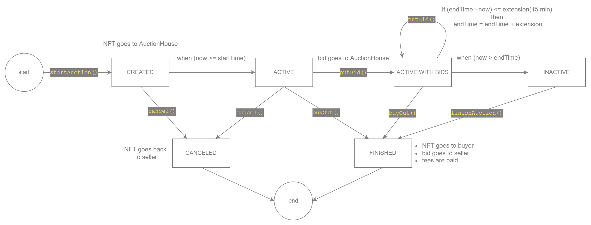

# Auctions

## Auctions types

In Rarible Protocol implements English auction with fixed step. We have two AuctionHouse contracts for different type of sell asset. At that moment, we support English auction only for Ethereum and Polygon blockchains.

AuctionHouse contracts types:

* `AuctionHouse721`
    * sell asset = ERC-721
    * buy asset = ETH or ERC-20
    * supports party bid
* `AuctionHouse1155`
    * sell asset = ERC-1155
    * buy asset = ETH or ERC-20

## Features

There are two parameters of AuctionHouse that are the same for all auctions and can be changed by AuctionHouse owner:

* `minimalDuration` — defines the minimal duration of auctions
* `minimalStepBasePoint` — is the minimal percentage increase between bids (in base points). For example, `minimalStepBasePoint` = 300 = 3%, first bid is 100 ETH, the second one should be not less than (100 + 100*3% =) 103

Auction time frame is decided by 2 parameters:

* `duration`
    * mandatory parameter, that defines the duration of auction in seconds
    * it must be between `minimalDuration`(default value is 15 days) and `1000 days` (constant)
* `startTime`
    * optional parameter that defines the start time an auction
    * unix timestamp, can't be less than the time of creation of the auction

So there are two cases of how the auction time frame can work:

* if `startTime` is 0, then the auction starts at the first bid that satisfies `minimalPrice`. Then the `endTime` is calculated at the moment of the first bid as well (`now` + `duration`)
* if `startTime` is set, then the `endTime` is calculated at the creation of an auction (`startTime` + `duration`)

If a new bid is put when auction has less than `minimalDuration` left till `endTime`, then `endTime` = `now` + `minimalDuration`

<figure markdown>
{ width="1400" }
  <figcaption>Auction House</figcaption>
</figure>

## Data model

### Auction ERC721

* **address sellToken** — sell asset contract address
* **uint sellTokenId** — sell asset tokenId
* **address buyAsset** — buy asset contract address if ERC20 (address(0) if buy asset = ETH)
* **uint96 endTime** — auction end time in unix timestamp
* **Bid lastBid** — last successful `Bid`
* **address payable seller** — seller address
* **uint96 minimalPrice** — minimal amount of the first bid
* **address payable buyer** — last successful bidder
* **uint64 protocolFee** — protocolFee at the time of auction creation
* **bytes4 dataType** — version of `data` field
* **bytes data** — encoded additional data, V1 fields
    * **uint originFee** — auction origin fee in one uint slot (first 12 bytes store value, last 20 bytes store recipient)
    * **uint duration** — auction duration
    * **uint startTime** — auction start time
    * **uint buyOutPrice** — auction buyOut price (if bid amout > buyout price, then auction finishes and all transfers are done)

### AuctionERC1155

The main difference from struct Auction ERC721 is the additional field **uint96 sellTokenValue**

* **address sellToken** — sell asset contract address
* **uint96 sellTokenValue** — sell asset value
* **uint sellTokenId** — sell asset tokenId
* **address buyAsset** — buy asset contract address if ERC20 (address(0) if buy asset = ETH)
* **uint96 endTime** — auction end time in unix timestamp
* **Bid lastBid** — last successful `Bid`
* **address payable seller** — seller address
* **uint96 minimalPrice** — minimal amount of the first bid
* **address payable buyer** — last successful bidder
* **uint64 protocolFee** — protocolFee at the time of auction creation
* **bytes4 dataType** — version of `data` field
* **bytes data** — encoded additional data, V1 fields
    * **uint originFee** — auction origin fee in one uint slot (first 12 bytes store value, last 20 bytes store recipient)
    * **uint duration** — auction duration
    * **uint startTime** — auction start time
    * **uint buyOutPrice** — auction buyOut price (if bid amout >= buyout price, then auction finishes and all transfers are done)

### Bid

* **amount** — `bid` amount
* **dataType** — version of `data` field
* **data** — encoded additional data, V1 fields
    * **uint originFee** — bid origin fee in one uint slot (first 12 bytes store value, last 20 bytes store recipient)

### Main functions

**startAuction**

* start new auction
* emits event `AuctionCreated(uint indexed auctionId, address seller, uint128 endTime)`
* can be called from anyone
* arguments for ERC721 Auction
    * **address _sellToken** — sell token address
    * **uint _sellTokenId** — sell token Id
    * **address _buyAsset** — buy asset address (0 if ETH)
    * **uint96 minimalPrice** — minimal first bid price
    * **bytes4 dataType** — data field type
    * **bytes memory data** — additional Data
* arguments for ERC1155 Auction (1 additional field uint96 _sellTokenValue)
    * **address _sellToken** — sell token address
    * **uint96 _sellTokenValue** — sell token value
    * **uint _sellTokenId** — sell token Id
    * **address _buyAsset** — buy asset address (0 if ETH)
    * **uint96 minimalPrice** — minimal first bid price
    * **bytes4 dataType** — data field type
    * **bytes memory data** — additional Data

**putBid**

* puts bid on specific auction
* emits event `BidPlaced(uint indexed auctionId, address seller, uint128 endTime)`
* can be called from anyone
* arguments:
    * **_auctionId** — auction Id
    * **bid** — bid struct

**finishAuction**

* finishes auction if it's ended(now > endTime) and has at least 1 bid
* emits event `AuctionFinished(_auctionId)`
* can be called from anyone
* arguments:
    * **_auctionId** — auction Id

**buyOut**

* buy out the sell item and finishes the auction
* emits event `AuctionBuyOut(uint indexed auctionId, address buyer)`
* emits event `AuctionFinished(_auctionId)`
* can be called from anyone
* arguments:
    * **_auctionId** — auction Id
    * **bid** — bid struct

**cancel**

* finishes auction if it's not started and has no bids
* emits event `AuctionCancelled(uint indexed auctionId)`
* emits event `AuctionFinished(_auctionId)`
* can be called from auction creator
* arguments:
    * **_auctionId** — auction Id
